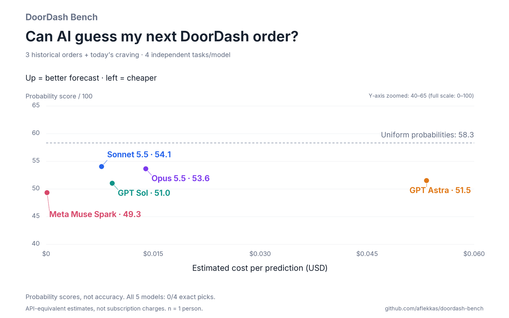

# DoorDash Bench

Can AI guess my next DoorDash order? Apparently my stomach is a harder eval than expected.



**Sonnet leads the tested models at 54.1/100. Uniform probabilities score 58.3.** All five models missed all four exact picks. The score grades their probabilities, so being confidently wrong hurts more than being uncertain. This is one person's four food decisions, not a general model intelligence ranking.

| Model | Forecast score /100 | Estimated cost / prediction | Exact picks |
| --- | ---: | ---: | ---: |
| Claude Sonnet 5.5 | 54.1 | $0.00777 | 0/4 |
| Claude Opus 5.5 | 53.6 | $0.01398 | 0/4 |
| GPT Astra | 51.5 | $0.05334 | 0/4 |
| GPT Sol | 51.0 | $0.00926 | 0/4 |
| Meta Muse Spark | 49.3 | $0.000128 | 0/4 |
| Uniform probabilities | 58.3 | $0 model inference | — |
| Order frequency | 50.2 | $0 model inference | 0/4 |

Dollar amounts are **API-equivalent estimates, not subscription charges or invoices**. Claude/OpenCode supply their CLI estimates. Codex's measured input/cache/output tokens are priced offline at dated, verified [official OpenAI rates](https://developers.openai.com/api/docs/pricing). The chart includes prediction sessions' CLI context, output and observed cache usage. Shared setup/evaluator calls are reported separately. Rates and sources are saved with the run; no dollars are invented for missing measurements.

## Run it

Requires Python 3.10+, authenticated **Codex, Claude Code, and OpenCode CLIs**, and optionally the authenticated DoorDash **`dd-cli`**. No model SDK or direct model API calls. The harness uses existing CLI login/configuration. Run it from T3 Code or a regular terminal.

```sh
git clone https://github.com/aflekkas/doordash-bench.git
cd doordash-bench
python3 -m venv .venv
source .venv/bin/activate
python -m pip install -r requirements.txt

# Use the reviewed meal-name-only fixture.
python suite.py --history examples/history.json --target examples/target.json --out local/my-run
```

To use your own DoorDash history:

```sh
mkdir -p local
python doordash_adapter.py --output local/history.json --max-orders 10 --days 90
cp examples/target.json local/target.json
# Edit local/target.json to today's craving BEFORE running.
python suite.py --history local/history.json --target local/target.json --out local/personal-run
```

The current craving must match one of your historical meals. This version forecasts choices from a known menu; it doesn't discover new restaurants. At least four orders and two distinct meals are required. Each run needs a fresh output directory.

Only Codex installed? Add `--models sol,astra --setup-model sol --judge-model sol`. Update dated rates with `--prices your-rates.json`. Missing rates/costs remain unknown; the chart falls back to a clearly labeled tokens-per-task proxy when dollars aren't available for every model.

`dd-cli` isn't installed by this repo. The read-only adapter was verified with `dd-cli` 0.2.5. Use `dd-cli login` to authenticate your installed CLI. `/bin/dd` is a different program.

| ID | Installed CLI | Requested model |
| --- | --- | --- |
| `muse` | OpenCode | `meta/muse-spark-1.3-contributor` |
| `opus` | Claude Code | `claude-opus-5-5` |
| `sonnet` | Claude Code | `claude-sonnet-5-5` |
| `sol` | Codex | `gpt-6.1-sol` |
| `astra` | Codex | `gpt-6-astra` |

No silent model fallback. The chart names the requested models; CLI-reported model metadata remains in the raw run records.

## Four tasks, real data

The published fixture contains six actual orders, newest first, with only restaurant/item names and relative sequence.

Three historical tasks hide each of the three newest orders. A model sees **only older orders** and forecasts the next meal. The fourth task uses all six past orders to forecast today's craving: **Dave's #2: 2 Sliders w/ Fries**, confirmed before the run.

Every model receives the same six meal choices, built from the historical menu. Choice IDs come from a canonical alphabetical sort, not recency. Their display order is shuffled identically for each model. Each task uses a **fresh isolated CLI session**; batching overlapping histories would reveal earlier hidden answers through later contexts.

A setup model writes [the brief](results/v2-2026-10-03/brief.md) from the fixed evaluation specification. It never receives history or answers. Models return only a probability distribution over meal IDs. A blinded Opus evaluator independently audits exact-pick counts; Python calculates the probability scores. Tool use invalidates a prediction. No cart or checkout code is exposed.

Default budget: **20 short predictions + one setup + one evaluator**, no automatic retries. Low/minimal reasoning, two concurrent sessions, no tools. Claude has a $0.50 per-session cap; CLI timeout and reply instructions aren't a universal spending cap. Normal CLI billing/subscription limits apply.

## Score

We use multiclass Brier loss, converted to a higher-is-better score:

```text
loss = sum((predicted_probability - actual_outcome)^2) over meal choices
score = 100 × (1 - loss / 2), averaged over all four tasks
```

100 means complete confidence in the correct meal; 0 means complete confidence in a wrong meal. A uniform distribution over six choices scores 58.3. This is **not an accuracy percentage**. The definition and 0–2 multiclass loss range follow the [scikit-learn Brier documentation](https://scikit-learn.org/stable/modules/model_evaluation.html#brier-score-loss); no scikit-learn dependency is needed.

We also report exact top-1 picks, with ties broken by smallest meal ID. Uniform top-1 tie-breaking is arbitrary, so its exact-pick count isn't presented as random-sampling accuracy. Every model needs all four valid tasks to receive an aggregate score; failures cannot raise a score by dropping a hard task.

Baselines are uniform probabilities, observed meal counts with fixed 0.5 smoothing, and repeating the latest meal. The score does not reward long explanations or invent subjective partial-credit categories.

## Audit and share

[Full v2 results](results/v2-2026-10-03/run.json) include every probability, cost/usage record, score, setup/evaluator response, and answer/prompt commitments. Those hashes were saved before predictions; they are local commitments, not public preregistration. Costs and reference pricing were added as an offline analysis after the measurements. CLI startup, cache warmth, and system prompts differ; this is a CLI harness comparison.

An early development attempt encoded chronology in menu IDs. Review caught it; that attempt was excluded and all five models ran once on the corrected protocol. The run manifest documents it. We didn't select the best score across runs. The original one-craving experiment remains available in [v1](results/2026-10-03/README.md): every model picked rice and scored 15/100 under its different rubric. V1 and v2 scores aren't comparable.

Download [the PNG](results/v2-2026-10-03/chart.png) or [vector SVG](results/v2-2026-10-03/chart.svg). Regenerate without spending model tokens:

```sh
python chart_v2.py results/v2-2026-10-03/run.json
python -m unittest discover -s tests -v
```

Tweet:

> new SOTA eval: guessing my DoorDash order.
>
> Sonnet beat the other models. A uniform distribution beat Sonnet.
>
> we have achieved artificial general indecision.

Fresh runs and personal exports default to gitignored `local/` and `.scratch/`. Only reviewed meal names and public results are committed. No raw DoorDash account data or credentials are published.

MIT code. Inter and Caveat fonts retain their bundled SIL Open Font Licenses. Independent joke project; not affiliated with DoorDash.
