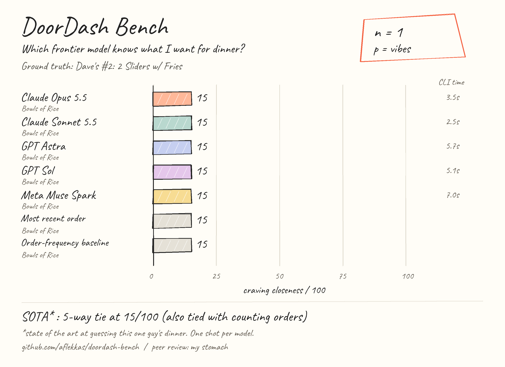

# DoorDash Bench

Frontier models. Six food orders. One guy who wants Dave's.

**State of the art at guessing my dinner.** `n=1`, `p=vibes`, peer review by my stomach.



This runs your installed **Codex, Claude Code, and OpenCode CLIs**, using their existing login/configuration. No model SDK, direct API calls, or API keys in this repo. You can start it from T3 Code or a regular terminal.

## Run it

Requires Python 3.10+, authenticated model CLIs, and the authenticated DoorDash **`dd-cli`** if you want to fetch your own history. The included history fixture lets you try the harness without DoorDash access. This repo doesn't install or provide `dd-cli`; its adapter was tested with version 0.2.5. `/bin/dd` is a different program.

```sh
git clone https://github.com/aflekkas/doordash-bench.git
cd doordash-bench
python3 -m venv .venv
source .venv/bin/activate
python -m pip install -r requirements.txt
mkdir -p local

# Fetch your actual orders with the read-only DoorDash CLI.
python doordash_adapter.py --output local/history.json --max-orders 10 --days 90

# Write today's actual craving BEFORE running. Keep it out of the history.
cp examples/target.json local/target.json
# Edit local/target.json and review local/history.json.
python benchmark.py --history local/history.json --target local/target.json --out local/my-run
```

To reproduce the published task using its six meal-name-only orders:

```sh
python benchmark.py --history examples/history.json --target examples/target.json --out local/example-run
```

Have only Codex installed? Use `--models sol,astra --setup-model sol --judge-model sol`. Each run needs a fresh output directory. Model IDs live in `cli_runners.py`; change them to models your CLI account actually supports. No silent model substitution.

| ID | CLI | Requested model |
| --- | --- | --- |
| `muse` | OpenCode | `meta/muse-spark-1.3-contributor` |
| `opus` | Claude Code | `claude-opus-5-5` |
| `sonnet` | Claude Code | `claude-sonnet-5-5` |
| `sol` | Codex | `gpt-6.1-sol` |
| `astra` | Codex | `gpt-6-astra` |

That's the five-model roster selected for this run, not a claim to cover every model ever released. Muse Spark is one model here.

## What happens

1. **History:** `dd-cli --json-output order history` supplies the evidence. The adapter exports only restaurant names, item names, and relative sequence, newest first. It has no cart or checkout code.
2. **Setup model:** Sonnet summarizes the evidence and explains a fixed rubric. Its summary and the original meal names become `brief.md`. It never receives today's answer. The harness freezes the rubric, target hash, and prompt hash before contestants run.
3. **Contestants:** five fresh CLI sessions get the identical prompt and return one restaurant, meal, and short reason. Empty working directories, suppressed personal instructions, tools disabled, low/minimal effort. No browsing, menu search, or ordering.
4. **Evaluator model:** Opus sees shuffled anonymous predictions, the hidden answer, and the rubric in one batch. It classifies meal similarity and writes a short roast. Python computes points from those classifications; exact restaurant matching is deterministic.
5. **Chart:** actual scores become a hand-drawn PNG. `run.json` retains the answers, judge classifications, usage, wall times, and hashes. Failed or invalid runs have **no score**, not zero.

Default budget: **one setup call + five predictions + one evaluator call**. Two contestants run concurrently. Replies are short; no retries happen automatically. Claude has a $0.50 per-session cap; Codex/OpenCode expose different limits, so short replies and timeouts aren't a universal spending cap. These are authenticated model CLIs, and their normal billing or subscription limits still apply.

## Scoring

One top-1 guess. **Closeness points out of 100, not an accuracy percentage.** The model judge classifies semantic item/category matches; it doesn't choose a winner.

| Guess, when an exact meal is specified | Points |
| --- | ---: |
| Correct restaurant + exact meal | 100 |
| Correct restaurant + same main food/form, different sides or quantity | 85 |
| Correct restaurant + different meal | 70 |
| Different restaurant, Nashville/spicy fried chicken | 45 |
| Other chicken meal | 30 |
| Rice/protein bowl | 15 |
| Other meal | 0 |

With no target items, score only the restaurant/category: 100 / 60 / 40 / 20 / 0. A rice bowl containing chicken belongs to the bowl category; the first published evaluator also classified all bowl guesses this way. Exact restaurant comparison ignores punctuation/case and accepts aliases you explicitly list in the target.

Two cheap baselines use the newest order and the most frequent restaurant. Frequency ties break by recency, and that restaurant's most recent meal is chosen. Today's newest restaurant and frequency winner happen to be the same.

## The actual run

Ground truth, confirmed before predictions: **Dave's Hot Chicken — Dave's #2: 2 Sliders w/ Fries**. Six actual historical orders, four restaurants, two repeats each for Dave's and Bowls of Rice. No synthetic personal history.

**Muse, Opus, Sonnet, Sol, and Astra all chose Bowls of Rice and scored 15/100**, tying both counting baselines. [Full results, reply token counts, and the documented Muse infrastructure retry](results/2026-10-03/README.md).

See [the frozen brief](results/2026-10-03/brief.md), [predictions and scores](results/2026-10-03/run.json), [rubric](results/2026-10-03/rubric.json), and [manifest](results/2026-10-03/manifest.json). The published run has one prediction per successful model. CLI versions/system prompts differ; latency includes CLI startup and OpenCode configuration discovery. Usage retains provider-specific fields, including cached tokens, rather than pretending they are directly comparable. Missing counts are `null`.

This is one person's one craving, with a model-written summary and model-judged partial credit. No confidence intervals, general intelligence ranking, or statistically meaningful SOTA claim. The original order list stays in the brief so the setup model can't quietly erase inconvenient clues.

Personal data and fresh runs default to gitignored `local/` or `.scratch/`. Only the reviewed meal-name fixture and published run are committed. Don't commit raw DoorDash responses or CLI configuration files.

## Share it

The full-size image is [chart.png](results/2026-10-03/chart.png). Regenerate it without spending model tokens:

```sh
python chart.py results/2026-10-03/run.json
python -m unittest discover -s tests -v
```

Caption: **“I benchmarked five frontier models on the only eval that matters: what I want for dinner. Every single one tied with counting my orders. They picked rice. I wanted Dave's. AGI is cancelled.”**

MIT for the code. Caveat font, copyright The Caveat Project Authors, bundled under the SIL Open Font License in `assets/OFL-Caveat.txt`. Independent joke project; not affiliated with DoorDash.
